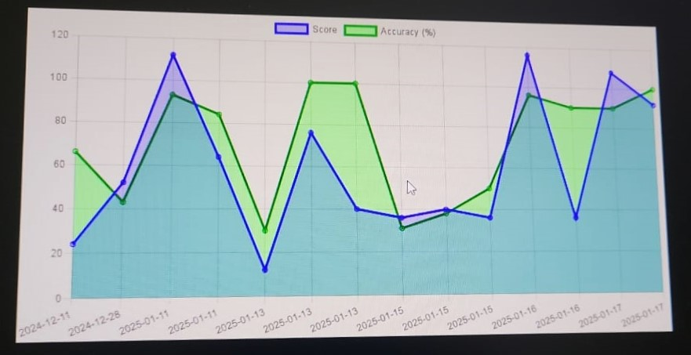
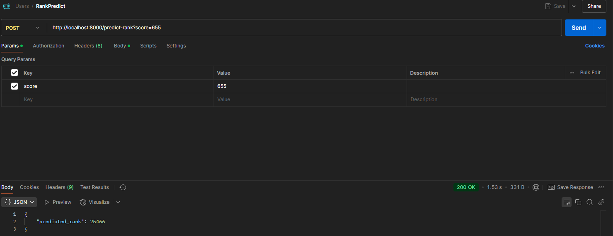
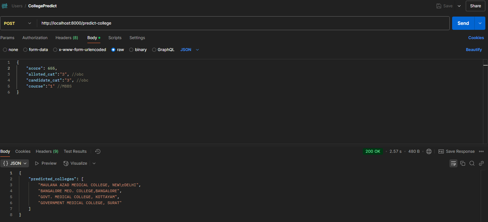

# NEET Performance Analyzer 📊  

An analytical tool designed to assess students' **NEET** exam performance based on quiz data, predict their **rank**, and suggest areas for improvement.  

---

## **🚀 Project Overview**
This project provides **insights into student performance** using **historical quiz data** and **current submissions**.  
The system performs:
- **Performance Trend Analysis**
- **Mistake Identification**
- **Weak Topic Recommendations**
- **Rank Prediction**
- **College Prediction (Bonus Feature)**

---

## **📂 Dataset Overview**
The project utilizes two datasets:
1. **Current Quiz Data**: Latest quiz submissions with **topics, questions, and responses**.
2. **Historical Quiz Data**: Past **5 quiz performances** with scores and response maps.
3. **Dataset for Prediction**: Additionally I have used 2 dataset (added in dataset folder) for training my prediction models.

---

## **🛠️ Features & API Endpoints**
| **Feature**                           | **Route**                            | **Description** |
|----------------------------------------|--------------------------------------|----------------|
| 🔍 **Performance Analysis**            | `/analyze`                           | Analyze quiz data and identify the **strong and weak topics** according to student performance. |
| 📊 **Performance Trend**               | `/performance-trend`                 | Track **historical performance trends**. |
| 📉 **Performance Trend Graph (PNG)**    | `/performance-trend-graph`           | Generates a **trend graph (PNG format)** of performance over time. |
| ❌ **Mistake Analysis**                 | `/mistake-analysis`                  | Highlights **common mistakes** and wrong answers. |
| 📈 **Compare Performance**              | `/compare-performance`               | Compare performance with **other users** or past attempts. |
| 📚 **Recommended Topics**               | `/recommended-topics`                | Suggests **weak topics** that need improvement. |
| 🎯 **Rank Prediction**                  | `/predict-rank`                      | Predicts **NEET rank** based on quiz score. |
| 🏫 **College Prediction (Bonus)**       | `/predict-college`                   | Predicts **likely colleges** based on predicted rank. |

---

## **🛠️ Setup Instructions**
### **1️⃣ Clone the Repository**
```bash
git clone https://github.com/yourusername/neet-performance-analyzer.git
cd neet-performance-analyzer
```
### **2️⃣ Install Dependencies**
```bash
npm install
pip install joblib scikit-learn numpy
```
Set the **.env file** (PORT = 8000 and CORS_ORIGIN = '*')

### **3️⃣ Run the Server**
```bash
npm run dev
```
### **4️⃣ API Testing**
- Use **Postman or curl** to test endpoints.
- Example:
```bash
curl -X POST "http://localhost:8000/predict-rank?score=500"
```


## 🔬 Approach & Implementation
### 📌 Data Analysis & Insights
- Extracted **student quiz data** and identified **accuracy trends**.
- Performed **topic-wise mistake analysis** to detect weak areas.
- Generated a **performance trend graph** from historical data.
- **Calculated Percentile** of the using maths logic and **rated** the studnt accordingly.

### 📌 Rank Prediction Model
- **Trained a RandomForest model** using **NEET past results** to predict Rank.
- Used **joblib** to save and load the model for efficient predictions.

### 📌 College Prediction (Bonus)
- Based on the **predicted rank**, we mapped NEET cut-off data to suggest probable colleges, **DecisionTree Model** was used for this.


## 📷 Screenshots & Visualizations
### 1️⃣ Performance Trend Graph


### 2️⃣ Rank Prediction Example


### 3️⃣ College Prediction Example



## 👨‍💻 Contributors
- **ATHUL KRISHNA K R** (Github : https://github.com/Athul-coder-021)

## 📧 Contact
- For queries, feel free to reach out: 📩 ak021coder@gmail.com
- LinkedIn : https://www.linkedin.com/in/athul-krishna-k-r-73165b255/
